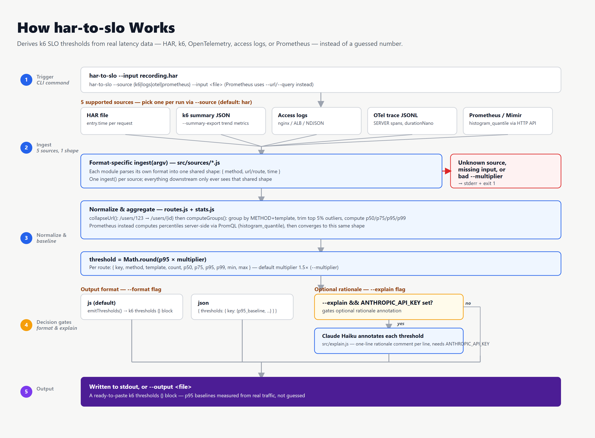
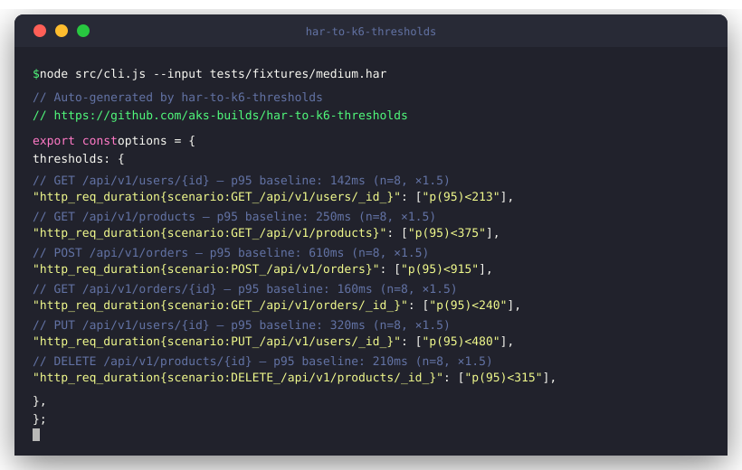

<div align="center">

# 📐 har-to-slo

**Your HAR file already knows your p95. You just haven't asked it yet.**

Every time you record a HAR — from Playwright, Chrome DevTools, an API gateway export, or a browser session —
you're capturing real latency measurements for every route in your app. `har-to-slo` reads those measurements,
computes p95 baselines per route, and outputs a ready-to-use k6 `thresholds {}` block.
**Stop inventing SLO numbers. Derive them.**

> **Not a HAR-to-k6-script converter.** [`grafana/har-to-k6`](https://github.com/grafana/har-to-k6) replays traffic.
> `har-to-slo` reads the *timings* in that same file and turns them into statistically grounded SLO baselines.
> They complement each other — use both.

[](https://github.com/aks-builds/har-to-slo/actions/workflows/ci.yml)
[](https://github.com/aks-builds/har-to-slo/actions/workflows/codeql.yml)
[](https://www.npmjs.com/package/har-to-slo)
[](LICENSE)
[](skills/har-to-slo.md)

<br/>



<br/>



<sub>☝️ Real output from a 48-entry HAR. Six routes, all HTTP methods, zero configuration.</sub>

</div>

---

## The problem it solves

When you add a k6 `thresholds {}` block, you need a number:

```javascript
"http_req_duration{url:/api/orders}": ["p(95)<???"],
```

Where does that number come from? Usually: a guess, a round number, or copied from another service.
`har-to-slo` answers that question with **measured data from your own traffic**.

---

## Install

```bash
# No install needed — run with npx
npx har-to-slo --input recording.har
```

---

## Usage

```bash
# Basic — outputs k6 thresholds block to stdout
npx har-to-slo --input recording.har

# Tighter SLOs (1.2× p95 instead of default 1.5×)
npx har-to-slo --input recording.har --multiplier 1.2

# JSON — for CI pipelines and tooling integrations
npx har-to-slo --input recording.har --format json

# Write directly into your k6 script file
npx har-to-slo --input recording.har --output k6/thresholds.js

# With LLM rationale for each threshold (requires ANTHROPIC_API_KEY)
npx har-to-slo --input recording.har --explain
```

---

## Supported sources

| Source | Command | What it reads |
|---|---|---|
| `har` (default) | `har-to-slo --input recording.har` | HAR file timing data |
| `k6` | `har-to-slo --source k6 --input summary.json` | k6 `--summary-export` JSON |
| `logs` | `har-to-slo --source logs --input nginx.log` | nginx / ALB / NDJSON access logs |
| `otel` | `har-to-slo --source otel --input traces.jsonl` | OpenTelemetry trace JSONL export |
| `prometheus` | `har-to-slo --source prometheus --url http://prom:9090 --query http_request_duration_seconds` | Prometheus / Mimir HTTP API |

### Using with the Grafana stack

```bash
# From a k6 load test run
k6 run --summary-export summary.json load-test.js
har-to-slo --source k6 --input summary.json

# From Grafana Mimir (or any Prometheus)
har-to-slo --source prometheus \
  --url http://mimir.internal:9090 \
  --query http_request_duration_seconds \
  --range 30d

# From Grafana Tempo trace export (OTEL JSONL)
har-to-slo --source otel --input tempo-export.jsonl
```

---

## How it works

```
HAR file
  └─ entry.time per request (real latency in ms)
       └─ collapse URLs: /users/123 → /users/{id}
            └─ group by METHOD + template
                 └─ trim top 5% outliers
                      └─ compute p95 per group
                           └─ threshold = Math.round(p95 × multiplier)
                                └─ emit k6 thresholds {} block
```

A HAR entry's `.time` field is the total wall-clock duration of that request as observed by the client.
This is the same number your users experience. It's the right number for an SLO.

---

## Output example

Given a HAR with requests to 6 routes:

```javascript
// Auto-generated by har-to-slo
// https://github.com/aks-builds/har-to-slo

export const options = {
  thresholds: {
    // GET /api/v1/users/{id} — p95 baseline: 142ms (n=8, ×1.5)
    "http_req_duration{scenario:GET_/api/v1/users/_id_}": ["p(95)<213"],
    // GET /api/v1/products — p95 baseline: 250ms (n=8, ×1.5)
    "http_req_duration{scenario:GET_/api/v1/products}": ["p(95)<375"],
    // POST /api/v1/orders — p95 baseline: 610ms (n=8, ×1.5)
    "http_req_duration{scenario:POST_/api/v1/orders}": ["p(95)<915"],
  },
};
```

---

## Using alongside grafana/har-to-k6

These tools do different things and work together:

```bash
# Step 1 — generate a k6 load test script from your HAR recording
npx har-to-k6 recording.har -o load-test.js

# Step 2 — generate statistically grounded thresholds for that script
npx har-to-slo --input recording.har --output thresholds.js

# Step 3 — merge thresholds.js into load-test.js
```

`har-to-k6` asks: *"what requests should my load test replay?"*
`har-to-slo` asks: *"what latency should I fail the load test at?"*

---

## Options

| Flag | Default | Description |
|---|---|---|
| `--input`, `-i` | *(required)* | Path to HAR file |
| `--multiplier`, `-m` | `1.5` | Threshold = p95 × multiplier |
| `--format`, `-f` | `js` | Output format: `js` or `json` |
| `--output`, `-o` | stdout | Write to file instead of stdout |
| `--explain`, `-e` | off | Annotate with Claude Haiku rationale (needs `ANTHROPIC_API_KEY`) |

---

## E2E test results

| Dataset | Entries | Routes | Status |
|---|---|---|---|
| Small | 5 | 3 | ✅ |
| Medium | 48 | 6 | ✅ |
| Large | 500 | 10 (with UUIDs) | ✅ |

---

## Claude Code Skill

A bundled Claude Code skill lets AI agents call `har-to-slo` during PR review to check whether load test thresholds are grounded in real data or invented.

---

## License

MIT © [aks-builds](https://github.com/aks-builds)
